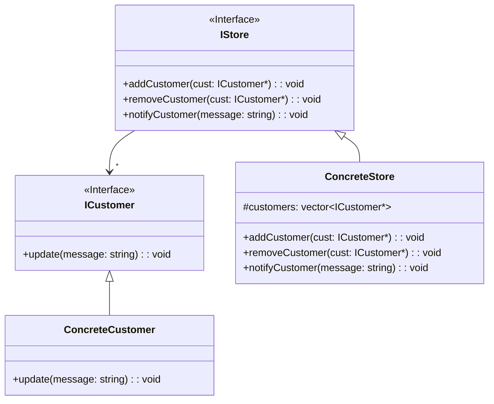

# TRƯỜNG ĐẠI HỌC KHOA HỌC TỰ NHIÊN, ĐHQG-HCM
## ĐỀ THI KẾT THÚC HỌC PHẦN - ĐẠI TRÀ (KHÔNG PHẢI ĐỀ GỐC)
## Học kỳ 2 – Năm học 2024-2025

| **Tên học phần:** | Phương pháp lập trình hướng đối tượng |
| :--- | :--- |
| **Mã HP:** | CSC10003 |
| **Thời gian:** | 90 phút |
| **Ngày thi:** | ?/?/2025 |
| **Ghi chú:** | ? |

> *Lưu ý: đề bài được soạn lại từ nháp và có sự hỗ trợ của AI.*

---
* **Link đề:** [https://drive.google.com/drive/folders/1G4CP0dqZLEkeByg7HPZcweW60bYRk7vU](https://drive.google.com/drive/folders/1G4CP0dqZLEkeByg7HPZcweW60bYRk7vU)
* **Video giải đề** [https://www.youtube.com/live/YgUJvEdALzs?si=uZbUIIOXMKZRvfUp](https://www.youtube.com/live/YgUJvEdALzs?si=uZbUIIOXMKZRvfUp)

---

**Câu 1 (2đ)**

a) Trong c++, từ khóa protected khác gì từ khóa private khi được kế thừa. Cho ví dụ minh họa.

b) Giải thích khái niệm virtual function và vai trò của từ khóa override trong kế thừa. Cho ví dụ minh họa.

**Câu 2 (3đ)**

Cho sơ đồ lớp sau:



a) Khai báo các class, attribute, method theo diagram trên. (1đ) <br>
b) Cài đặt các hàm `addCustomer()`, `removeCustomer()`, `notifyCustomer()`, `update()`. (2đ) <br>
&emsp;Để đơn giản, hàm `notifyCustomer()` sẽ duyệt qua các Customer và gọi hàm `update()`. Còn hàm `update()` sẽ in message ra màn hình

**Câu 3**

&emsp;Trong một công ty đang phát triển, việc tiếp nhận hồ sơ ứng tuyển từ hàng trăm, thậm chí hàng nghìn ứng viên mỗi ngày là điều phổ biến. Tuy nhiên, một vấn đề nan giải thường gặp là cách đặt tên file CV của các ứng viên rất lộn xộn và không theo một quy chuẩn nào. Điều này gây ra nhiều khó khăn cho bộ phận tuyển dụng trong việc quản lý, tìm kiếm và sắp xếp hồ sơ, làm giảm hiệu quả quy trình tuyển dụng tổng thể.

&emsp;Để giải quyết vấn đề này, bạn được yêu cầu phát triển một công cụ tự động hóa để chuẩn hóa tên file CV. Công cụ có khả năng áp dụng một chuỗi các quy tắc định dạng được xác định trước, giúp biến những cái tên file "ngẫu hứng" thành những cái tên có cấu trúc, dễ quản lý và tìm kiếm hơn. Điều này không chỉ giúp cải thiện hiệu suất của đội ngũ tuyển dụng mà còn góp phần tạo nên một hệ thống quản lý hồ sơ chuyên nghiệp và hiệu quả hơn.

Các quy tắc bên dưới được áp dụng cho từng file theo thứ tự sau:

| Tên Luật | Mô Tả Chi Tiết |
| :--- | :--- |
| NormalizeCasing | Luật này sẽ chuyển đổi tên file sao cho chữ cái đầu tiên của mỗi từ được viết hoa, và các ký tự còn lại của từ đó sẽ là chữ thường. Điều này giúp đồng bộ hóa cách viết hoa, bất kể tên file gốc được viết như thế nào. |
| RemoveSpecialCharacters | Luật này chịu trách nhiệm loại bỏ tất cả các ký tự đặc biệt khỏi tên file. Các ký tự như dấu gạch ngang (-), gạch dưới (_), khoảng trắng ( ), dấu chấm (.) |
| AddDatePrefix | Luật này sẽ thêm tiền tố là ngày tháng năm hiện tại vào đầu tên file. Định dạng của tiền tố là yyyymmdd_. Mục đích là để dễ dàng nhận biết thời điểm file được xử lý hoặc nộp, hữu ích cho việc sắp xếp theo thời gian. |

**Ví dụ minh họa**

* **Tên file gốc:** `ho so xin viec cua nguyen van A`
* **Áp dụng NormalizeCasing:** `Ho So Xin Viec Cua Nguyen Van A`
* **Áp dụng RemoveSpecialCharacters:** `HoSoXinViecCuaNguyenVanA`
* **Áp dụng AddDatePrefix:** `20250709_HoSoXinViecCuaNguyenVanA`
* **Kết quả cuối cùng:** `20250709_HoSoXinViecCuaNguyenVanA`

**Bản nháp chương trình:**

```cpp
1  #include <iostream>
2  #include <string>
3  #include <vector>
4  using namespace std;
5  class Date {
6  private:
7      int day;
8      int month;
9      int year;
10 public:
11     Date getCurrentDate();
12 };
13 class RenameCVFileUseCase {
14 public:
15     string rename(const string& originalFilename);
16
17 };
18
19 int main() {
20     RenameCVFileUseCase cvFileRenamer;
21
22     string originalFileName = "ho so xin viec_nguyen van a - cv_final.docx";
23
24     string formattedFileName = cvFileRenamer.rename(originalFileName);
25
26     cout << "Original File Name: " << originalFileName << endl;
27     cout << "Formatted File Name: " << formattedFileName << endl;
28
29     return 0;
30 }
```
&emsp;a) Vẽ sơ đồ lớp UML phục vụ yêu cầu trên. Yêu cầu các lớp phải tuân theo các quy tắc OOP để dễ dàng mở rộng và bảo trì.

&emsp;b) 
* Cài đặt hàm rename()
* Chỉnh sửa hàm main() (nếu cần thiết) để sử dụng hàm rename()

&emsp;c) Lần này object sẽ đọc các luật từ file `rules.txt` để thiết lập thứ tự và chỉnh sửa chi tiết các luật. Hãy chỉnh sửa sơ đồ lớp cho phù hợp với yêu cầu này.

&emsp;&emsp;Ví dụ của file `rules.txt`:

```text
NormalizeCasing
RemoveSpecialsCharacter Regex=[-_/.]
AddDatePrefix Format=yyyymmdd_
```

<center><strong>- HẾT -</strong></center>